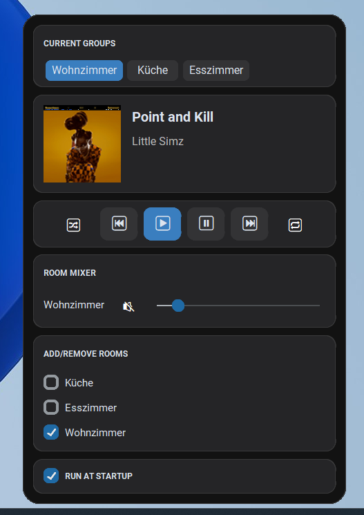

# Sonos-Control

A small desktop app to discover and control Sonos speakers on your local network. Provides playback and volume controls, grouping, and a tray/menubar interface for quick access.



Features
- Discover Sonos devices automatically.
- Playback controls: play, pause, next, previous, seek.
- Per-room volume and mute/unmute.
- Grouping support (create/manage Sonos groups where supported).
- Tray/menubar interface for quick actions.
- Programmatic API: core controller functions available in `sonos_controller.py`.

Quick start
Requirements
- Python 3.8+
- Network access to Sonos devices (same LAN/subnet)

Install dependencies

```bash
python -m pip install -r requirements.txt
```

Run the app
```
python main.py
```

Key files
- [main.py](main.py): App entry point and CLI options.
- [sonos_controller.py](sonos_controller.py): Core logic for discovery and control.
- [tray.py](tray.py): Tray/menubar UI and shortcuts.
- [config.py](config.py): Configuration and startup options.
- [requirements.txt](requirements.txt): Python dependencies.
- [tray.spec](tray.spec): PyInstaller spec for packaging.