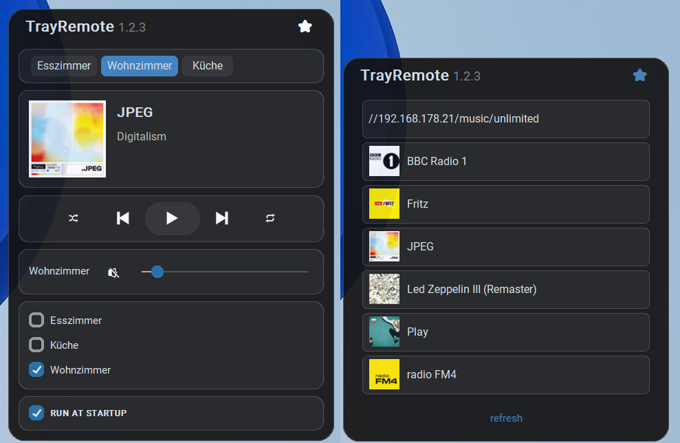

# TrayRemote

A small desktop app to discover and control Sonos speakers on your local network. Provides playback and volume controls, grouping, and a tray/menubar interface for quick access.



Features
- **Modern Glassmorphism UI:** New transparent, sleek design with interactive hover effects.
- **Sonos Favorites:** Dedicated tab to quickly access and play your favorite radio stations or music on network drives.
- **Automatic Discovery:** Seamlessly find Sonos devices on your local network.
- **Comprehensive Playback:** Play, pause, next, previous, and seek controls.
- **Multi-room Audio:** Per-room volume control and mute/unmute.
- **Group Management:** Easily create and manage Sonos speaker groups.
- **Tray Access:** Discreet system tray interface for quick, non-intrusive control.
- **Programmatic API:** Core controller functions available in `sonos_controller.py`.

Quick start
Requirements
- Python 3.8+
- Network access to Sonos devices (same LAN/subnet)

Install dependencies

```bash
python -m pip install -r requirements.txt
```

Run the app
```
python main.py
```

Key files
- [main.py](main.py): App entry point and system tray initialization.
- [sonos_controller.py](sonos_controller.py): Core Sonos logic: discovery, group management, and favorites handling.
- [tray.py](tray.py): Modern UI (CustomTkinter), tray lifecycle, and glassmorphism styling.
- [config.py](config.py): Persistent configuration (e.g., autostart).
- [requirements.txt](requirements.txt): Python dependencies.
- [tray.spec](tray.spec): PyInstaller configuration for standalone builds.